# Technical Projects

Three systems I built and run for my own use. Pink Anchor and its Android app are in daily use; their repository is private because it holds live configuration, so this page collects descriptions, diagrams, screenshots and selected code excerpts. Chat Archive Viewer is public.

**Specified, designed, tested, deployed and operated these systems, directing AI coding tools to write all the code.**

| Project | Period | What it is |
|---|---|---|
| [Pink Anchor](#pink-anchor) | Feb 2026 – present | Self-hosted memory and data service for AI assistants |
| [Pink Anchor for Android](#pink-anchor-for-android) | Mar 2026 – present | Health data pipeline and app |
| [Chat Archive Viewer](#chat-archive-viewer) | May 2026 | Client-side reader for exported AI chats |

---

## Pink Anchor

**Self-hosted memory and data service for AI assistants** · Feb 2026 – present

Stack: Ubuntu, Python/FastAPI, SQLite FTS5, Docker Compose, Model Context Protocol (MCP), Cloudflare Tunnel

AI assistants forget everything between conversations and between apps. Pink Anchor is one private store for my notes, project documents, conversation summaries and health data. Assistants read and write it through MCP tools.

- Designed 7 multi-action MCP tools through which AI assistants read and write memory, grouping actions to save context-window space, and combining Chinese full-text and vector search for retrieval.
- Deployed 8 Docker Compose services, rebuildable with one command, on a 2 GB RAM virtual server secured by Cloudflare Tunnel as the only web entry, a default-deny firewall and key-only SSH.
- Automated daily off-site backups of 177,000+ records, from notes, project documents and conversation summaries to health data, and monthly restore drills that check integrity and row counts. Added failure alerts and pre-commit secret scanning.

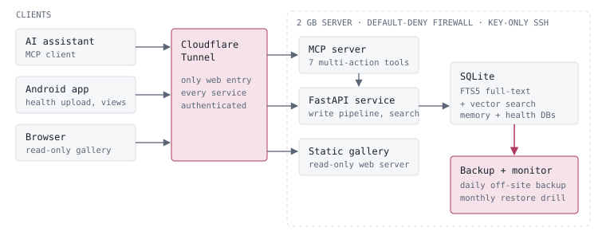

### How the memory works

The full write-up is in **[docs/memory-system.md](docs/memory-system.md)**. In short:

- **Seven tools instead of thirty-six.** Every tool description is sent to the assistant at the start of each conversation and uses up context. Each tool takes an `action` argument (`search`, `create`, `update`, `delete`, `audit`, ...), so the whole set costs about 2,500 tokens.
- **One write path for every client.** New memories are rate-limited, checked against recent entries for duplicates, and merged into an existing entry when they cover the same subject.
- **Two search paths.** Chinese full-text search (SQLite FTS5 with word segmentation) runs alongside vector search. Scores combine keyword relevance, recency and a bonus when both paths agree. If the vector service is down, search falls back to full-text only.
- **A rule that came from a bug.** A query made only of function words ("do you remember?") gives full-text search nothing to match. Search must continue to the vector path instead of returning empty.

### Backups and restore drills

- Every day, nine items are copied off-site. The database is copied with SQLite's online backup API so recent write-ahead-log changes are not lost. Any failed item sends an alert.
- On the 1st of each month a drill downloads the latest off-site backup, checks file sizes against the manifest, runs `PRAGMA integrity_check`, compares row counts with the live database and confirms every archive opens. Every monthly drill since August 2026 has passed all 24 checks.

### Code excerpts

| File | Shows |
|---|---|
| [hybrid_search.py](excerpts/hybrid_search.py) | Full-text + vector search, scoring, fallback |
| [memory_write_filters.py](excerpts/memory_write_filters.py) | Content filters, rate limit, duplicate check, merge |
| [mcp_tools.py](excerpts/mcp_tools.py) | Multi-action MCP tools |
| [monthly_restore_drill.sh](excerpts/monthly_restore_drill.sh) | Monthly restore drill checks |

---

## Pink Anchor for Android

**Health data pipeline and app** · Mar 2026 – present

Stack: Kotlin, Jetpack Compose, Health Connect

- Specified the pipeline from a wearable through Health Connect and the app to FastAPI, SQLite and MCP tools, with idempotent uploads of 7 record types and nightly roll-ups of older heart-rate and step data.
- Reproduced a silent sync failure on a real device and confirmed from app and server logs that clearing app storage had revoked Health Connect permissions. Directed the fix and verified it in the release build.

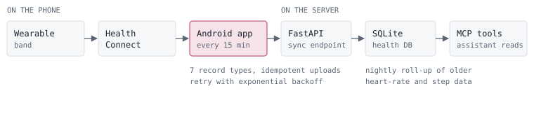

### Screens

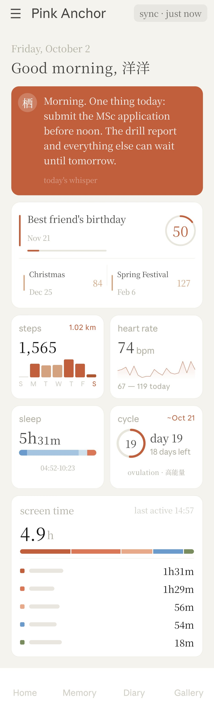

*Screenshots from my own phone, with personal details covered. The home screen combines captures from different days.*

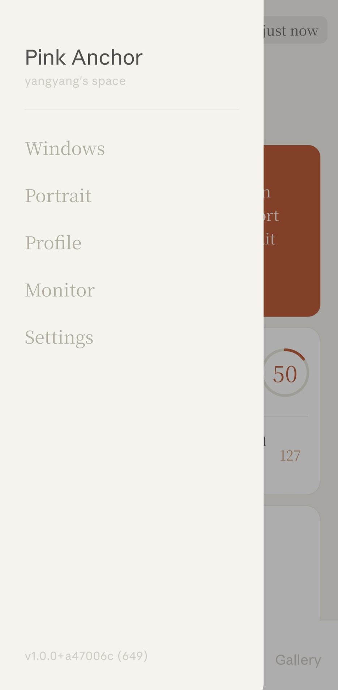
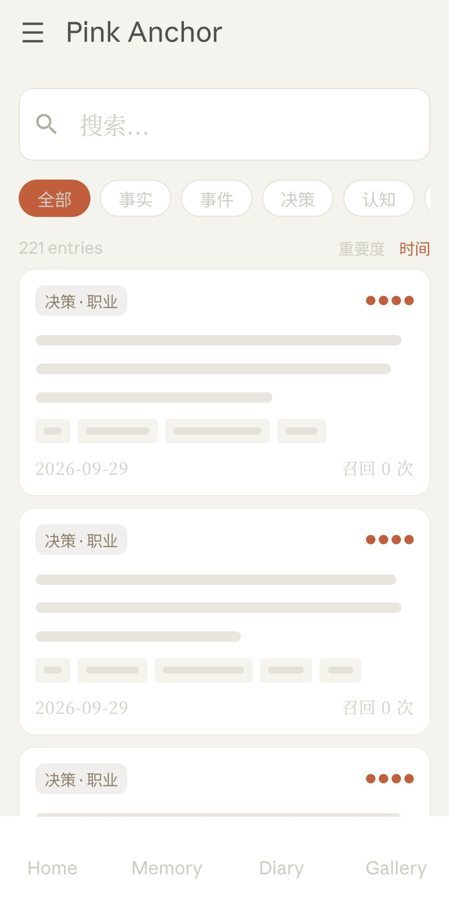
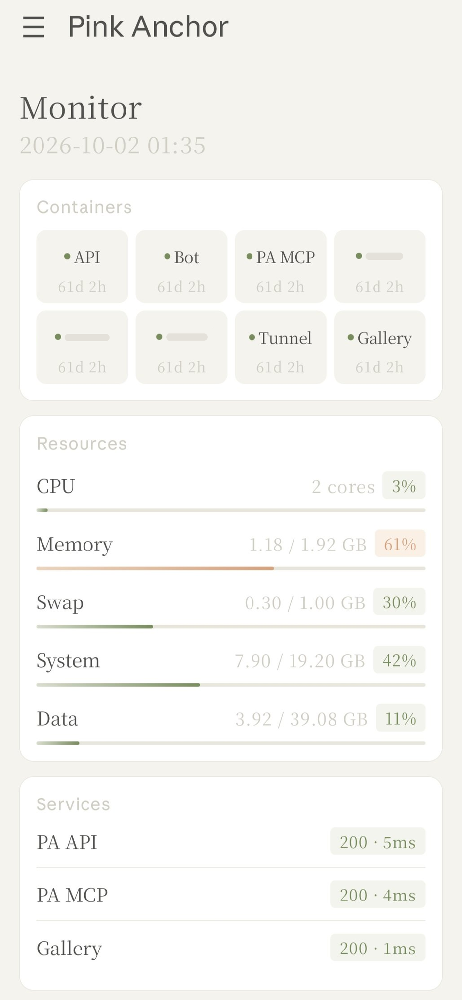
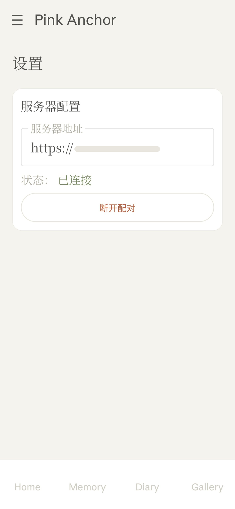

### The silent sync failure

After app storage was cleared, health data stopped reaching the server and the app showed no error. I reproduced it on my phone and matched the phone's logs against the server's request log. Clearing storage had also revoked the Health Connect permissions, so the background job failed its permission check and exited without telling anyone. The fix makes the job report the reason, shows the real sync status, and links straight to the screen where access can be granted again. I built the signed release and verified the fix on the device.

### Code excerpt

| File | Shows |
|---|---|
| [HealthSyncWorker.kt](excerpts/HealthSyncWorker.kt) | Background sync, permission check, idempotent upload, retry |

---

## Chat Archive Viewer

**Client-side reader for exported AI chats** · May 2026

Stack: HTML/JavaScript, IndexedDB, GitHub Pages · [github.com/QithYang/chat-archive-viewer](https://github.com/QithYang/chat-archive-viewer)

- Designed a static web app that parses exported AI chat archives entirely in the browser, with IndexedDB storage, UUID-based deduplication on re-import and a public demo built on synthetic data.

**[Live demo](https://qithyang.github.io/chat-archive-viewer/)** · The full source is public in the repository above.

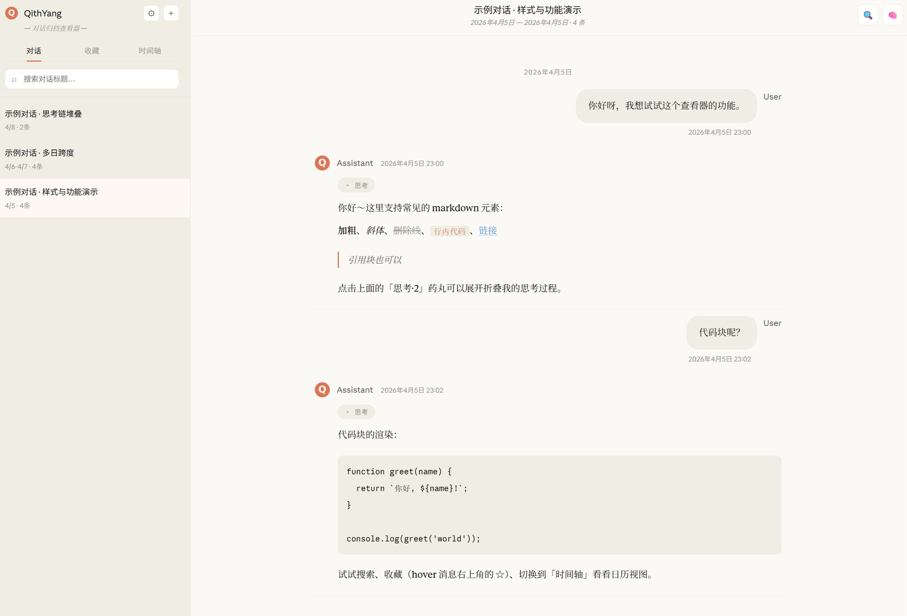
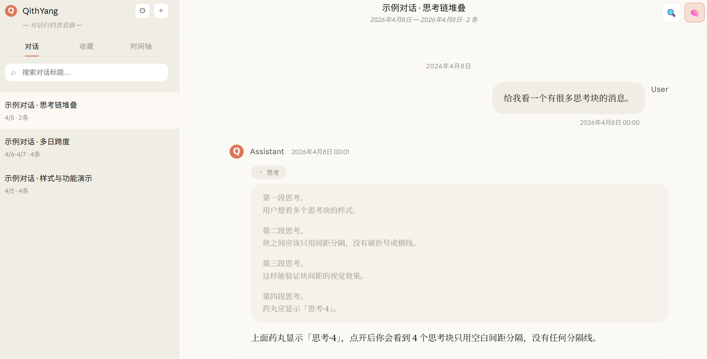

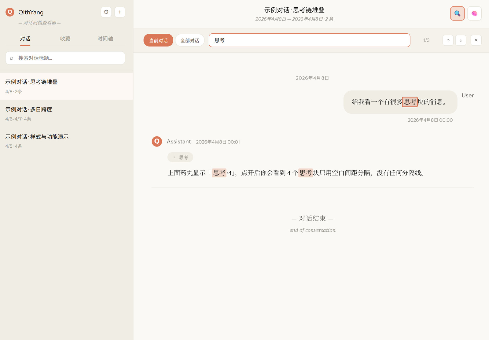
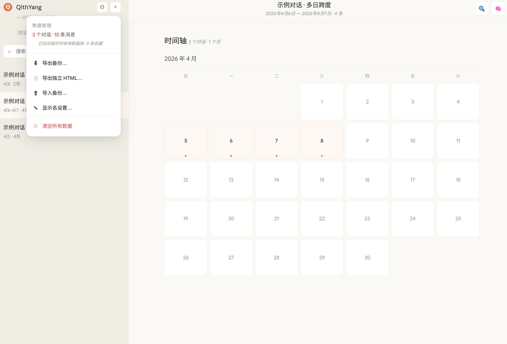

*Chat view, thinking blocks, search, and the timeline with the data menu. The interface is in Chinese; the screenshots show the bundled synthetic sample conversations, not real data.*

- **Chat view:** Markdown rendering, code blocks, and collapsible thinking and tool-call blocks.
- **Navigation:** conversation list with title search, bookmarks grouped by conversation, and a month-calendar timeline.
- **Search:** within the current conversation or across all of them, with highlighting and next/previous jumps.
- **Re-import:** importing a newer export merges conversations by UUID instead of duplicating them.
- **Export:** a JSON backup, or a self-contained HTML file that opens on its own.
- **Privacy:** everything stays in the browser's IndexedDB; the page sends no data anywhere.
