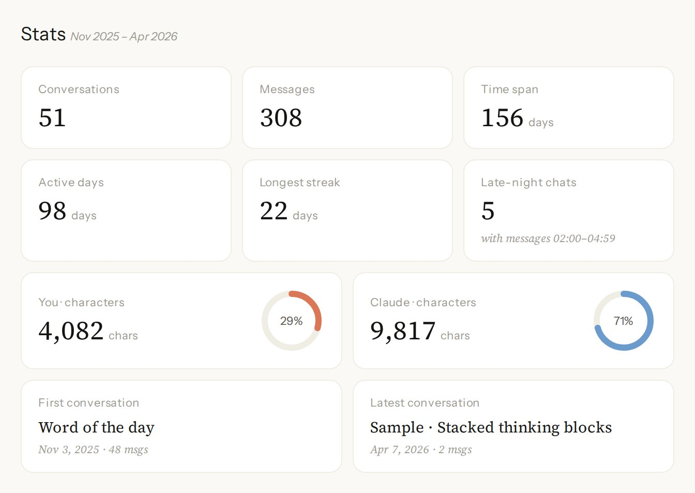
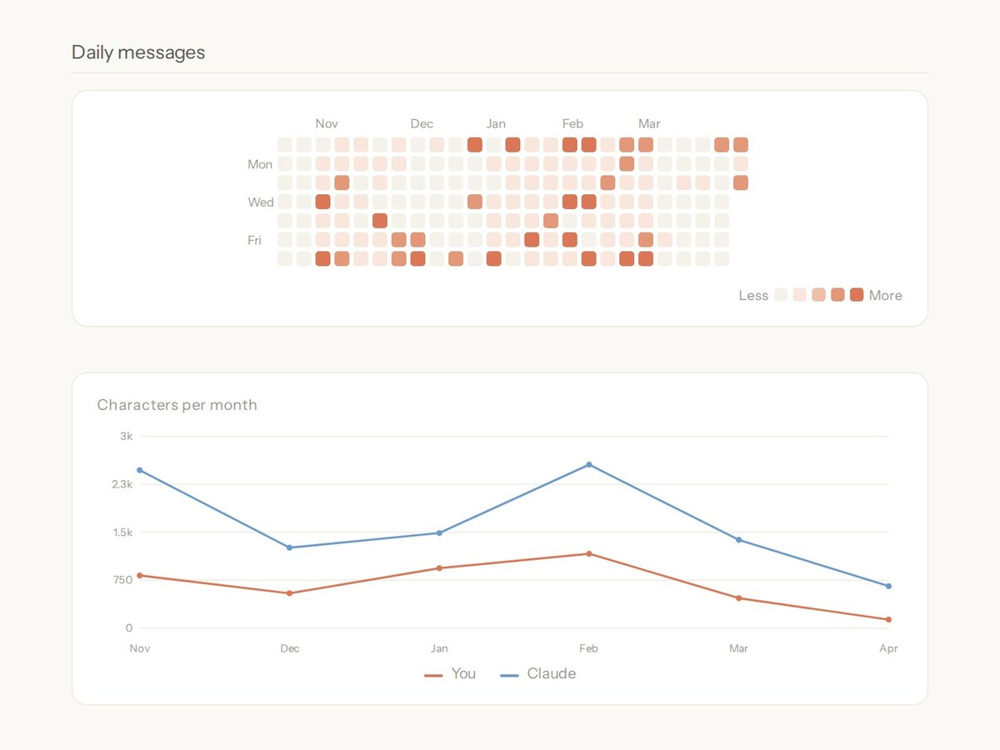
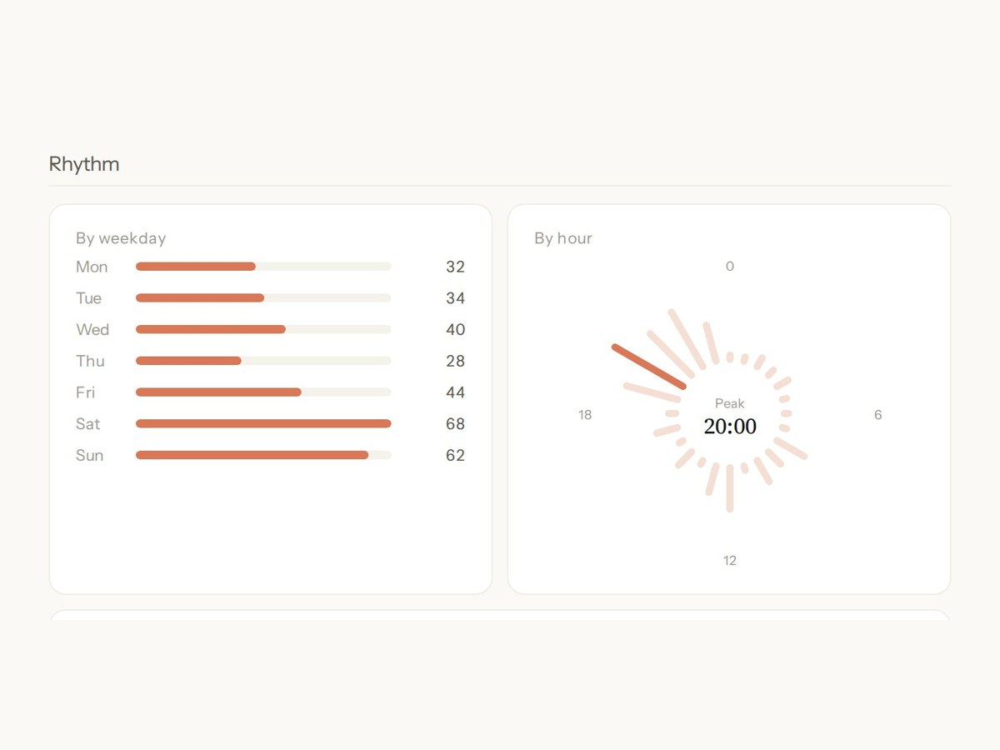
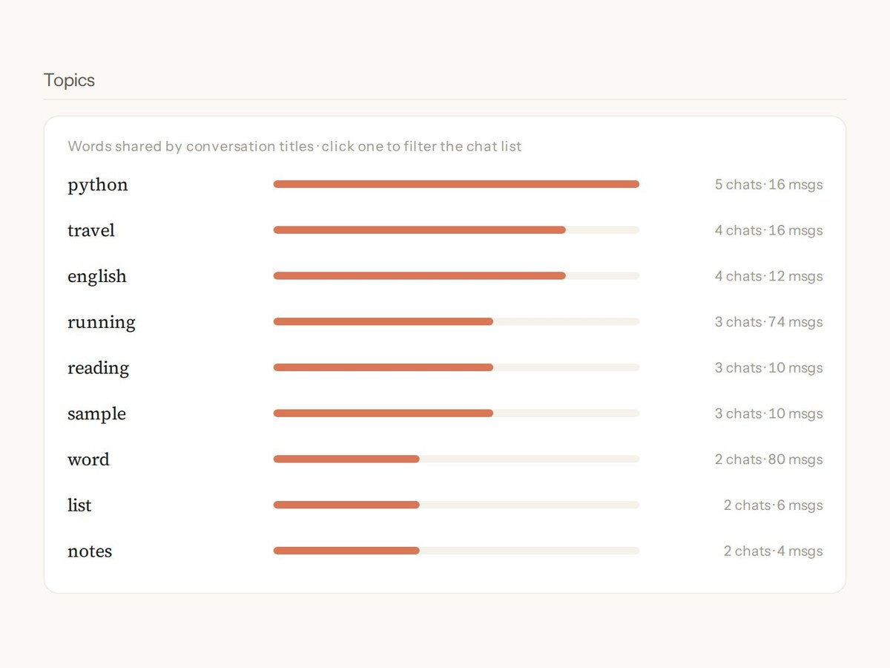
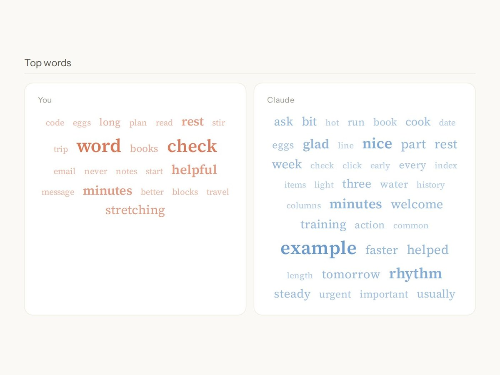
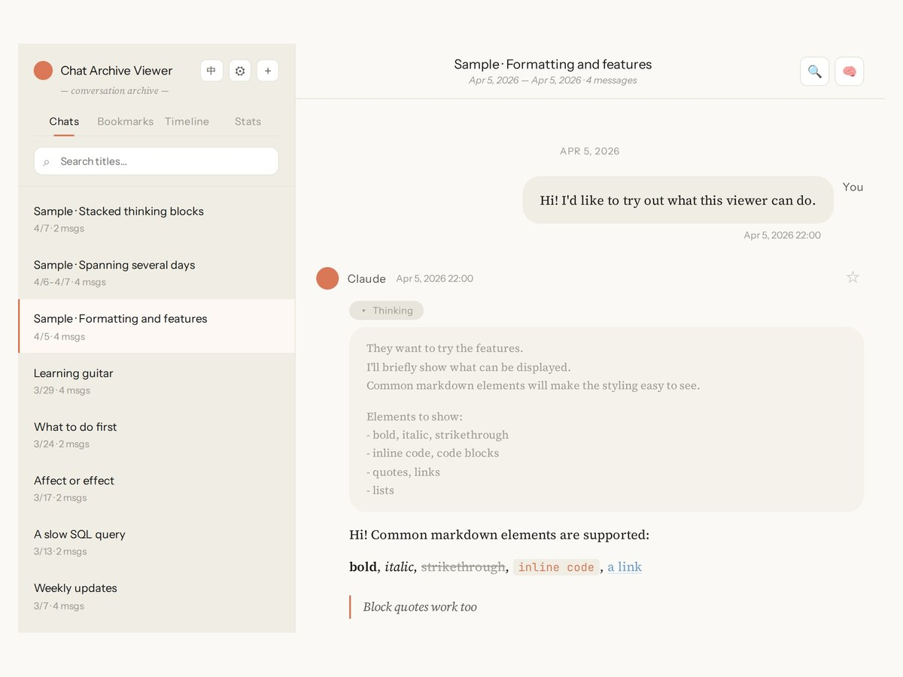
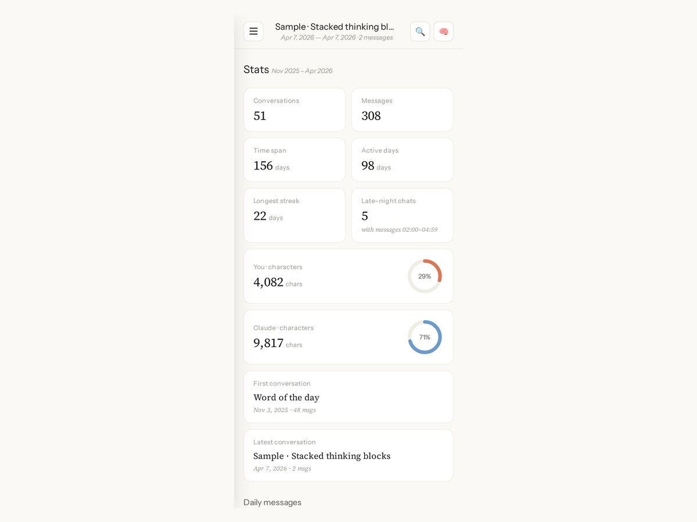

# Technical Projects

Three systems I built and run for my own use. Pink Anchor and its Android app are in daily use; their repository is private because it holds live configuration, so this page collects descriptions, diagrams, screenshots and selected code excerpts. Chat Archive Viewer is public, with a live demo.

Specified, designed, tested, deployed and operated these systems, directing AI coding agents to write the code.

| Project | Period | What it is |
|---|---|---|
| [Pink Anchor](#pink-anchor) | Feb 2026 – present | Self-hosted memory and data service for AI assistants |
| [Pink Anchor for Android](#pink-anchor-for-android) | Mar 2026 – present | Mobile client for Pink Anchor, with a health data pipeline |
| [Chat Archive Viewer](#chat-archive-viewer) | May 2026 – present | Analytics dashboard and reader for exported AI chats |

---

## Pink Anchor

**Self-hosted memory and data service for AI assistants** · Feb 2026 – present

Stack: Ubuntu, Python/FastAPI, SQLite FTS5, Docker Compose, Model Context Protocol (MCP), Cloudflare Tunnel

AI assistants forget everything between conversations and between apps. Pink Anchor is one private store for my notes, project documents, conversation summaries and health data. Assistants read and write it through MCP tools.

- Designed 7 multi-action MCP tools through which AI assistants read and write memory, grouping actions to save context-window space, and combining Chinese full-text and vector search for retrieval.
- Deployed 8 Docker Compose services, rebuildable with one command, on a 2 GB RAM virtual server secured by Cloudflare Tunnel as the only web entry, a default-deny firewall and key-only SSH.
- Automated daily off-site backups of 177,000+ records, from notes, project documents and conversation summaries to health data, and monthly restore drills that check integrity and row counts. Added failure alerts and pre-commit secret scanning.

### How the memory works

The full write-up is in **[docs/memory-system.md](docs/memory-system.md)**. In short:

- **Seven tools instead of thirty-six.** Every tool description is sent to the assistant at the start of each conversation and uses up context. Each tool takes an `action` argument (`search`, `create`, `update`, `delete`, `audit`, ...), so the whole set costs about 2,500 tokens.
- **One write path for every client.** New memories are rate-limited, checked against recent entries for duplicates, and merged into an existing entry when they cover the same subject.
- **Two search paths.** Chinese full-text search (SQLite FTS5 with word segmentation) runs alongside vector search. Scores combine keyword relevance, recency and a bonus when both paths agree. When the top rule-based score is already high, the vector call is skipped; if the vector service is down, search falls back to full-text only.
- **A rule that came from a bug.** A query made only of function words ("do you remember?") gives full-text search nothing to match. Search must continue to the vector path instead of returning empty.

### Retrieval evaluation

Benchmarked on 73 real logged queries, all relevance labels assigned by hand (intra-rater blind re-label agreement: weighted κ = 0.79). On the 44 queries with relevant memories, nDCG@5 rose 14% over BM25; a confidence gate that skips the vector call when the top rule-based score is high cut embedding calls and mean latency by 23%, with no measurable quality loss under cross-validation. Method and results: **[docs/retrieval-evaluation.md](docs/retrieval-evaluation.md)**.

### Backups and restore drills

- Every day, nine items are copied off-site. The database is copied with SQLite's online backup API so recent write-ahead-log changes are not lost. Any failed item sends an alert.
- On the 1st of each month a drill downloads the latest off-site backup, checks file sizes against the manifest, runs `PRAGMA integrity_check`, compares row counts with the live database and confirms every archive opens. Every monthly drill since August 2026 has passed all 24 checks.

### Code excerpts

| File | Shows |
|---|---|
| [hybrid_search.py](excerpts/hybrid_search.py) | Full-text + vector search, scoring, fallback |
| [memory_write_filters.py](excerpts/memory_write_filters.py) | Content filters, rate limit, duplicate check, merge |
| [mcp_tools.py](excerpts/mcp_tools.py) | Multi-action MCP tools |
| [monthly_restore_drill.sh](excerpts/monthly_restore_drill.sh) | Monthly restore drill checks (trimmed excerpt; the full drill runs 24 checks) |

---

## Pink Anchor for Android

**Mobile client for Pink Anchor, with a health data pipeline** · Mar 2026 – present

Stack: Kotlin, Jetpack Compose, Room, WorkManager, Health Connect

- Designed the app as Pink Anchor's mobile client: a home dashboard of health data, plus memory, diary, gallery and server-monitor views, with its own paired login and background sync every 15 minutes.

- Specified the pipeline from a wearable through Health Connect and the app to FastAPI, SQLite and MCP tools, with idempotent uploads of 7 record types and nightly roll-ups of older heart-rate and step data.
- Reproduced a silent sync failure on a real device and confirmed from app and server logs that clearing app storage had revoked Health Connect permissions. Directed the fix and verified it in the release build.

### Screens

*Screenshots from my own phone. The home screen combines captures from different days.*

### The silent sync failure

After app storage was cleared, health data stopped reaching the server and the app showed no error. I reproduced it on my phone and matched the phone's logs against the server's request log. Clearing storage had also revoked the Health Connect permissions, so the background job failed its permission check and exited without telling anyone. The fix makes the job report the reason, shows the real sync status, and links straight to the screen where access can be granted again. I built the signed release and verified the fix on the device.

### Code excerpt

| File | Shows |
|---|---|
| [HealthSyncWorker.kt](excerpts/HealthSyncWorker.kt) | Background sync, permission check, idempotent upload, retry |

---

## Chat Archive Viewer

**Analytics dashboard and reader for exported AI chats** · May 2026 – present

Stack: JavaScript, SVG, IndexedDB, GitHub Pages · [github.com/QithYang/chat-archive-viewer](https://github.com/QithYang/chat-archive-viewer)

- Designed an analytics dashboard that turns an AI chat export into a usage profile: activity over time, daily and weekly rhythm, each side's share of the writing, topics from conversation titles, and top words in Chinese and English.
- Defined every metric in the repository README, with choices that hold up on real data: only visible messages count, all times are local, and heatmap colours follow quartiles so the scale suits light and heavy users alike.
- One pure function computes every figure, checked by 12 automated tests on edge cases such as streaks across a month boundary and mixed Chinese and English text. Everything runs in the browser; no data is uploaded.
- The reader shows conversations with Markdown and thinking blocks, with search, bookmarks and a timeline, in English or Chinese.

**[Live demo](https://qithyang.github.io/chat-archive-viewer/)** (opens on the dashboard)

*Dashboard overview, then activity over time, weekly and daily rhythm, topics from titles, top words, the reader, and the dashboard on a phone. Screenshots use synthetic sample data; my own archive holds 11,000+ messages.*
