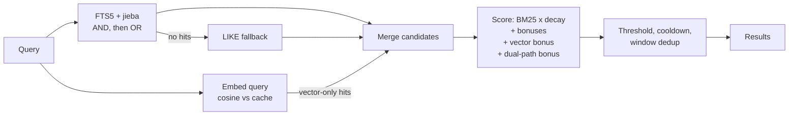

# How the memory system works

All examples in this document are synthetic.

Chat assistants forget everything between conversations, and each client (web chat, phone app, messaging bot) keeps its own history. Pink Anchor is a small self-hosted service that gives one user a single, private, long-term memory store. Any LLM client that speaks the Model Context Protocol (MCP) can read and write it through a few tools.

## Data model

Everything lives in SQLite on a 2-core, 2 GB server. Three tables carry most of the memory function.

**Memories** are short, one-sentence records about the user's life. Each row has:

- `what`: the memory itself, one concrete sentence.
- `category`: one of five fixed values (fact, event, decision, belief, relationship).
- `tag`: one of 17 fixed tags, each belonging to one category (for example, fact has personal-info, interests, habits, health and tech).
- `merge_key`: a subject key in the form `<tag>_<core word>`. Memories with the same key are about the same subject, so they get merged instead of duplicated.
- keywords, importance, pinned flag, timestamps, a stored embedding, and `deleted_at` for soft deletes. Every query filters on `deleted_at IS NULL`.

The enums are fixed on purpose. Free-form tags drift over time ("work", "job", "career") and quietly break merging and filtering.

**Windows** are summaries of whole conversations: title, tags, summary and date range. **Diaries** are longer entries with mood, tags and an optional snapshot of that day's health data.

## Write pipeline

All clients write through one function, so the same rules apply everywhere.

1. **Content filters.** When an LLM proposes a memory from a conversation, the candidate is rejected if it is about the system itself (tokens, prompts, models, the memory service), if its wording is abstract ("this reflects..."), or if it is shorter than 15 characters. The goal is concrete facts about the user's life.
2. **Rate limit.** At most 10 new memories per hour and 30 per day. This caps the damage if a model starts saving too eagerly.
3. **24-hour duplicate check.** The new text is compared with same-tag memories from the last day: similarity of 0.8 or more is skipped; 0.5 to 0.8 is merged.
4. **merge_key merge.** An existing memory with the same key absorbs the new one. For beliefs and preferences the newer text wins, because the latest statement is the truth; for facts the more complete text is kept.
5. **Insert.** The row and its full-text entry are written, and an embedding is requested in the background. If that call fails, the write still succeeds and a backfill job fills the gap later.

One weakness is recorded rather than hidden: the fuzzy branch of the merge step compares characters, not meaning, so two similar sentences with opposite meanings could be merged. For now, distinct merge keys avoid this.

## Retrieval and scoring

Search runs two paths and merges them.

- **Full-text search** uses SQLite FTS5. The text is mostly Chinese, which has no spaces between words, so it is tokenised with jieba plus a custom dictionary. Queries run in AND mode first and fall back to OR, then to a plain LIKE search.
- **Vector search** embeds the query and compares it by cosine similarity with every memory vector held in memory. At a few hundred memories a linear scan is fast enough, so there is no separate vector database.

Each candidate is scored as:

- BM25 relevance compressed into 0 to 1 with `b / (1 + b)`, multiplied by a **time decay**. Facts never decay, beliefs and relationships have a 180-day half-life, and events and decisions have 90 days. The decay has a floor of 0.5, so old memories rank lower but never disappear.
- plus bonuses for keyword overlap (proportional, up to +0.5), an exact tag match, the fact category, importance (small) and pinned items;
- plus a **non-linear vector bonus**, `0.8 * max(0, sim - 0.35)^1.5`, which stays near zero for weak matches and grows quickly for strong ones. A memory found by both paths gets a further +0.15.

Similarity thresholds depend on context: 0.45 for passive recall during chat (where a wrong memory is worse than none), 0.40 when the user asks a question, and 0.38 for explicit searches.

Two rules came from bugs:

- **No FTS tokens does not mean no results.** A question made only of function words, such as "do you remember?", produces no FTS tokens. Returning early at that point meant these questions never reached the vector path, which is the only one that can answer them.
- **If embeddings are unavailable, fall back to FTS only.** Search gets worse; it does not fail.

## Why seven tools, not thirty-six

The MCP server exposes seven tools: memory, conversation windows, diary, cycle tracking, gallery pages, health data and a vocabulary-app integration. Each takes an `action` argument (`search`, `create`, `update`, `delete`, `audit`, ...). One tool per operation would mean 36 tools.

The reason is the context window. Every tool's name, description and schema is sent to the model at the start of every conversation. The seven merged tools cost about 2,500 tokens; 36 separate schemas would repeat names, descriptions and shared parameters many times, in every chat. Longer usable conversations mattered more than a tidier one-function-per-tool design. For the same reason, descriptions are one line, results are trimmed to the fields the model needs, and errors come back as readable JSON so the model can fix a bad call. The MCP server holds no business logic: it forwards calls to the main API, so every client goes through the same write pipeline.

## Embedding cache

Vectors are stored in the database, which stays the source of truth, and loaded into memory for search. To make restarts faster, the cache is also saved as a NumPy `.npz` snapshot, written atomically (temp file, then rename).

On startup the snapshot is used only if the model name matches, the array shape is right, and a **fingerprint** matches. The fingerprint is the sorted list of `(id, last_modified)` for every active, embedded memory; every write path updates `last_modified`, so any change to the memory set changes it. If anything fails, or the file is unreadable, the service reloads from the database and writes a fresh snapshot. A damaged snapshot repairs itself instead of being trusted. One blind spot is noted in the code: editing a vector by hand without updating `last_modified` would go unnoticed.

## Backup and restore drill

- **Daily:** nine items go to an off-site store, and any failure triggers an alert. The database runs in WAL mode, so it is copied with SQLite's online backup API; copying the main file alone would silently lose recent changes still in the write-ahead log.
- **Weekly:** a self-verifying full archive, kept for 28 days.
- **Monthly:** an automated drill downloads the latest daily backup and runs 24 checks: file sizes match the manifest, the database passes `PRAGMA integrity_check` and its memory count is within 3 of the live database, and every archive is readable. The result is sent as a notification either way.

The drill does not start services from the restored data; moving to a new machine is handled by a separate script that defaults to a dry run.
